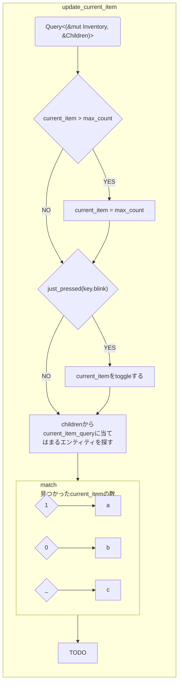

```mermaid
graph LR
subgraph S1["update_current_item"]
  A1("Query<(&mut Inventory, &Children)>") --> A2
  A2{current_item > max_count} -->|NO| A4
  A2 -->|YES| A3[current_item = max_count] --> A4
  A4{"just_pressed(key.blink)"} -->|NO| A6
  A4 -->|YES| A5[current_itemをtoggleする] --> A6
  A6[childrenからcurrent_item_queryに当てはまるエンティティを探す] --> S1-1

  subgraph S1-1["match<br>見つかったcurrent_itemの数"]
  direction LR
  %% TODO
  1A1{1} --> a
  1A2{0} --> b
  1A3{_} --> c
  end

  S1-1 --> A7
  A7[TODO]
end
```
