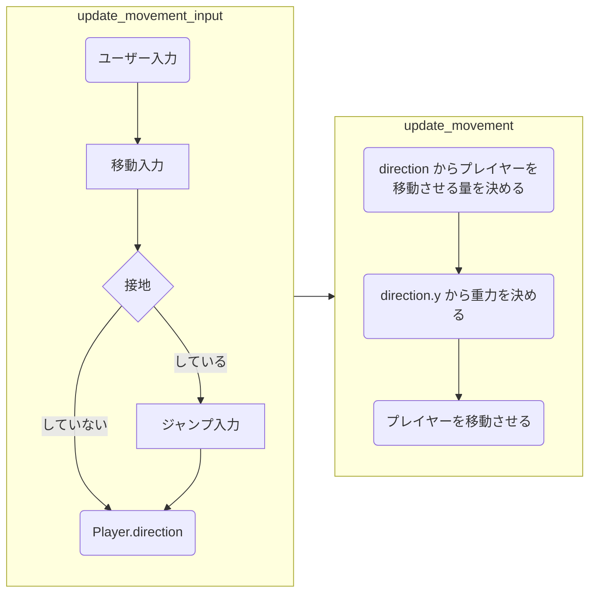

```mermaid
%% 書き方が合ってるかわからない
%% そもそもフローチャートが何なのか知らない

graph LR
subgraph S1["update_movement_input"]
  direction TB
  A1(ユーザー入力) --> A2
  A2[移動入力]--> A3
  A3{接地}
  A3 -->|していない| A5
  A3 -->|している| A4[ジャンプ入力]--> A5
  A5(Player.direction)
end

subgraph S2["update_movement"]
  direction TB
  n2-1(direction からプレイヤーを移動させる量を決める)
  n2-2(direction.y から重力を決める)
  n2-3(プレイヤーを移動させる)
  n2-1 --> n2-2 --> n2-3
end
S1 --> S2
```
