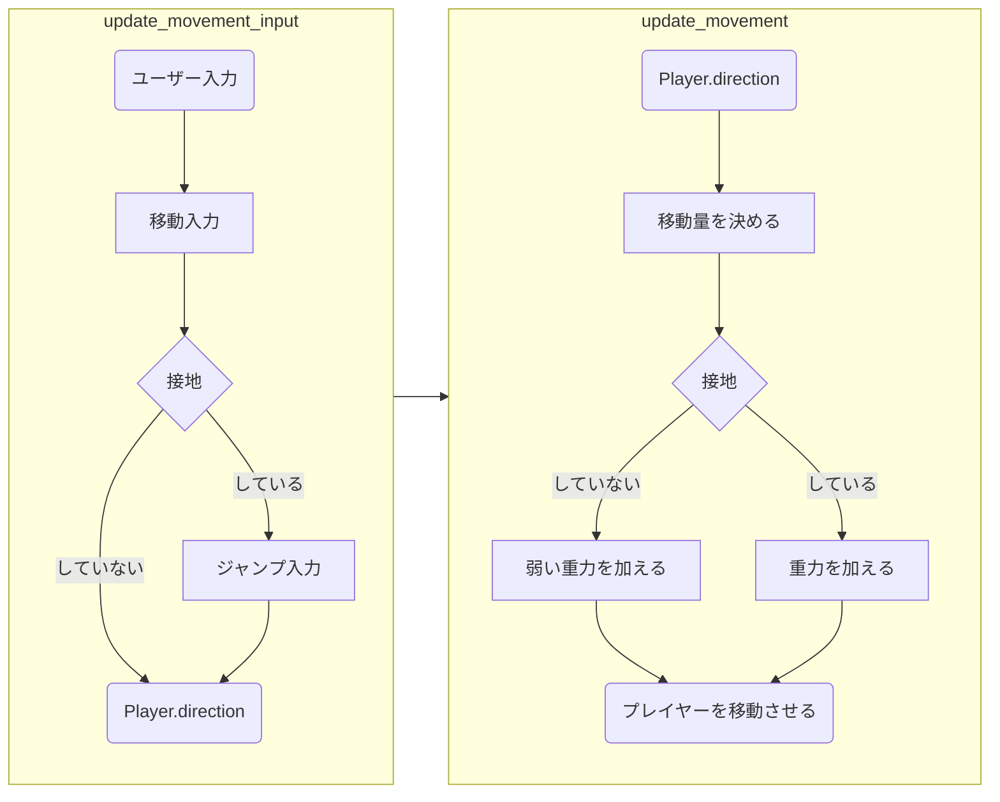

```mermaid
%% 書き方が合ってるかわからない
%% そもそもフローチャートが何なのか知らない

graph LR
subgraph S1["update_movement_input"]
  direction TB
  A1(ユーザー入力) --> A2
  A2[移動入力]--> A3

  A3{接地}
  A3 -->|していない| A5
  A3 -->|している| A4[ジャンプ入力]--> A5

  A5(Player.direction)
end

subgraph S2["update_movement"]
  direction TB
  B1(Player.direction) --> B2
  B2[移動量を決める] --> B3

  B3{接地}
  B3 -->|していない| B4[弱い重力を加える] --> B6
  B3 -->|している| B5[重力を加える] --> B6

  B6(プレイヤーを移動させる)
end
S1 --> S2
```
