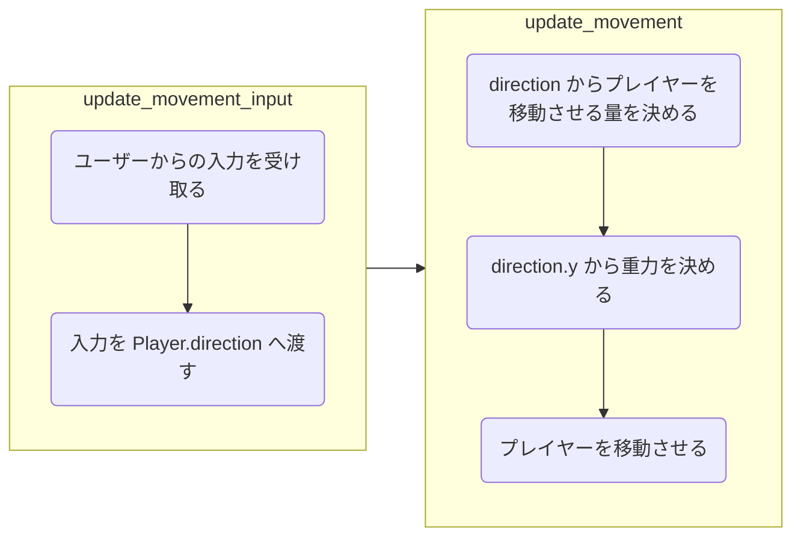

```mermaid
%% 書き方が合ってるかわからない
%% そもそもフローチャートが何なのか知らない

graph LR
subgraph s1["update_movement_input"]
  direction TB
  n1-1(ユーザーからの入力を受け取る)
  n1-2(入力を Player.direction へ渡す)
  n1-1 --> n1-2
end

subgraph s2["update_movement"]
  direction TB
  n2-1(direction からプレイヤーを移動させる量を決める)
  n2-2(direction.y から重力を決める)
  n2-3(プレイヤーを移動させる)
  n2-1 --> n2-2 --> n2-3
end
s1-->s2
```
